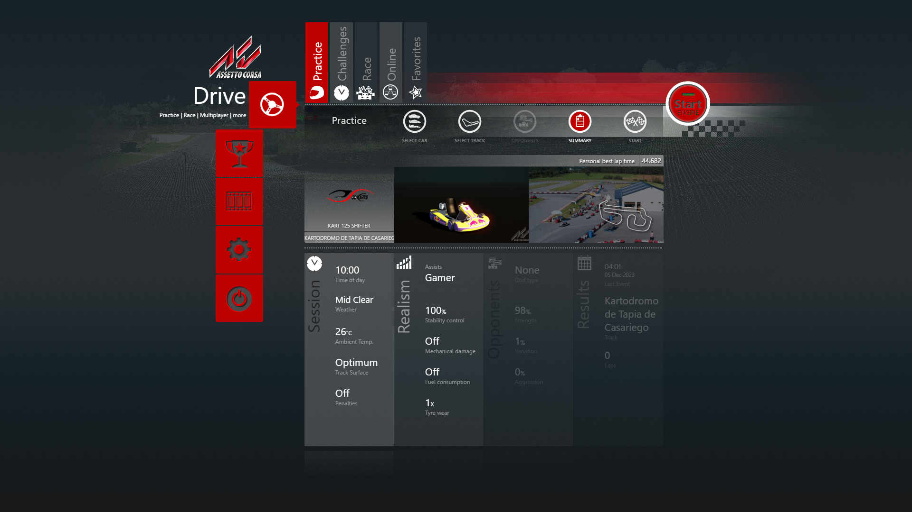
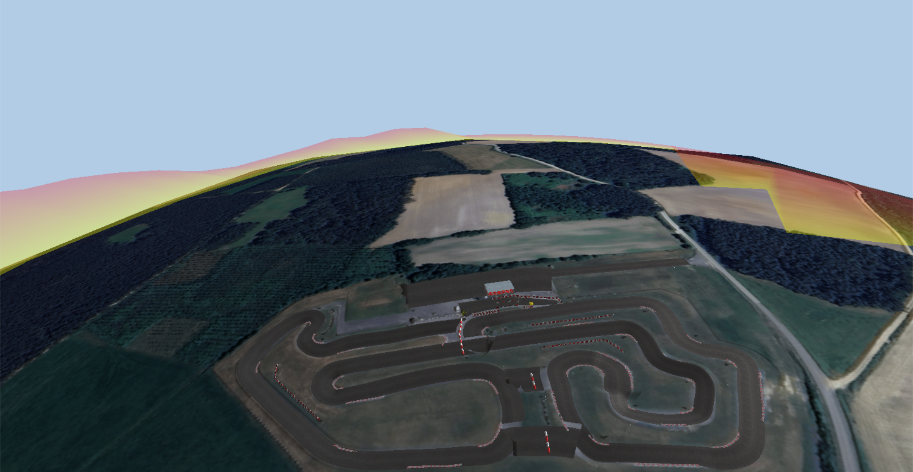
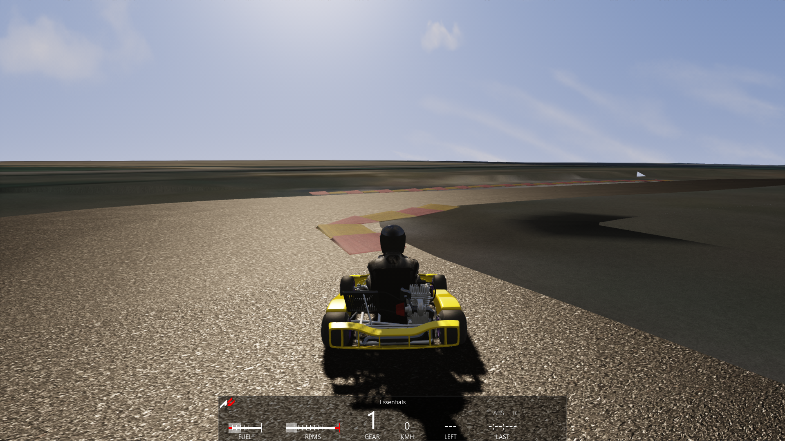
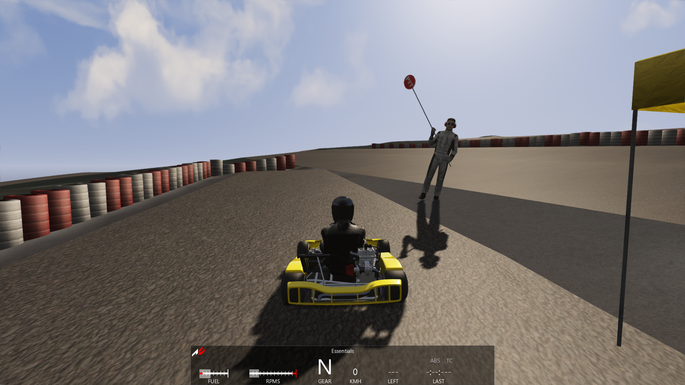
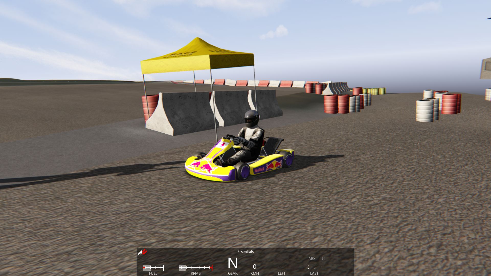

# Renderizado del circuito de karting de Tapia de Casariego

## Descripción

Renderizado del circuito de karting de Tapia de casariego realizado con el software [Race Track Builder](http://www.racetrackbuilder.com/)

## Descargas

En el area de releases se incluyen:

- Exportaciones a fbx
- Exportaciones para Assetto corsa

## Testeado

Para pruebas se utiliza el juego [Assetto Corsa](https://store.steampowered.com/app/244210/Assetto_Corsa/?l=spanish) con el mod de kart [GoKart](https://assettocorsamods.net/resources/gokart.115/)

## Capturas de pantalla

- Selección de circuito

- Vista aerea:

- Vista de pista:

- Vista de salida de carrera:

- Vista de salida en tercera persona:

## Agradecimientos:

- [Kartodromo Tapia de Casariego](https://www.kartodromodetapia.com/) por autorizar el renderizado de su fantastico circuito.

